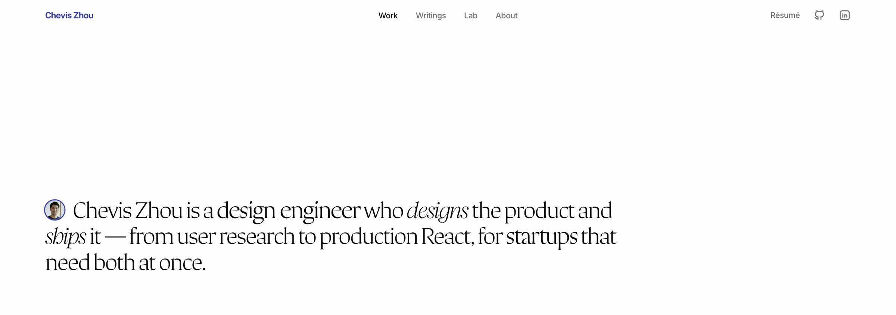

# Chevis Zhou

Design Engineer / Technical Product Designer. I design interfaces and build the code that ships them — most recently a Next.js portfolio built with an AI agent in the loop from the first commit.

**[cheviszhou.com](https://cheviszhou.com)** · [LinkedIn](https://www.linkedin.com/in/cheviszhou/) · cheviszhou@gmail.com

## Recent work

- **Solara** — owned UX strategy for the documentation portal that carried an open-source Python framework into its steepest growth: 170k monthly downloads and ~30k developers reached, on a 100+ component design system. [Case study](https://cheviszhou.com/projects/solara-webproduct)
- **Accessibility eye-tracking research** — MA capstone at GMU's Visual Attention and Cognition Lab, testing whether assistive technology can compensate for inaccessible sites. It can't: accessible builds scored SUS 88.3 vs 64.2 and took 2:06 vs 8:17 on the same tasks (exploratory, n=3). [Case study](https://cheviszhou.com/projects/ux-research)

## Stack

TypeScript · React · Next.js (App Router) · Tailwind · Figma · Framer

## Currently

Writing about the intersection of design and AI-assisted engineering — [cheviszhou.com/writing](https://cheviszhou.com/writing).

Publishing the [Claude Code skills](https://github.com/Chevis-Zhou/agent-skills) I use daily, plus notes on how the skill system is designed — trigger routing, skill chaining, and model/effort selection per phase.
